# Plateforme de Personnalisation Automobile

## Description

Projet web de personnalisation et réservation de véhicules développé avec Node.js, Express.js, MySQL et Socket.IO.

La plateforme permet aux utilisateurs :
- de consulter un catalogue de véhicules,
- de personnaliser différents modèles automobiles,
- de communiquer avec les administrateurs via une messagerie instantanée,
- d’effectuer des réservations et de suivre leurs commandes.

Le système contient également un espace administrateur complet pour la gestion des véhicules, réservations et accès administrateurs.

---

## Technologies Utilisées

### Front-end
- HTML5
- CSS3
- JavaScript

### Back-end
- Node.js
- Express.js

### Base de données
- MySQL
- phpMyAdmin
- XAMPP

### Bibliothèques et outils
- Socket.IO
- Multer
- dotenv
- CORS

---

## Architecture du Système

L’application adopte une architecture client-serveur :

- Front-end développé en HTML5, CSS3 et JavaScript
- Back-end construit avec Node.js et Express.js
- Base de données MySQL gérée via phpMyAdmin
- Communication temps réel avec Socket.IO
- Gestion des fichiers et images avec Multer
- Sécurisation via dotenv, CORS et middlewares Express.js

---

## Fonctionnalités Principales

### Catalogue de véhicules
- Consultation des fiches techniques
- Interface utilisateur responsive
- Recherche et navigation dans les catégories
- Consultation des différents modèles disponibles

### Personnalisation des véhicules
- Choix de la couleur
- Sélection des jantes
- Packs sportifs
- Équipements technologiques
- Calcul du prix en temps réel
- Sauvegarde de configuration

### Messagerie instantanée
- Communication client / administrateur
- Assistance rapide
- Questions sur les réservations et personnalisations

### Réservations
- Demande de réservation
- Gestion des commandes
- Génération automatique des factures

### Système d’administration

#### Administrateur principal
- Gestion complète du système
- Validation des nouveaux administrateurs
- Gestion des statistiques
- Attribution des droits d’accès

#### Administrateur secondaire
- Gestion des réservations
- Suivi des clients
- Accès limité aux fonctionnalités standards

---

## Sécurité

- Protection contre les attaques SQL Injection
- Validation des données côté serveur
- Gestion des sessions utilisateurs
- Middleware CORS
- Variables sensibles sécurisées avec `.env`
- Préparation HTTPS pour la production

---

## Notifications Automatiques

Le système envoie automatiquement :

- une facture électronique après validation d’une réservation,
- une notification au super administrateur lors d’une demande d’inscription administrateur.

---

## Installation

```bash
git clone https://github.com/nemicheroumaissa/RY-performance.git
cd RY-performance
npm install
npm start
```

---

# Implémentation des Fonctionnalités Clés

## 1. Catalogue de Véhicules et Interface Utilisateur

La première étape d’implémentation a porté sur la gestion du catalogue de véhicules et la création de l’interface utilisateur dédiée aux clients.

Cette interface permet :
- de parcourir les modèles disponibles,
- d’accéder aux fiches techniques,
- de lancer le configurateur de personnalisation,
- d’effectuer une réservation,
- de gérer l’espace personnel utilisateur.

La conception suit une architecture client-serveur claire : le front-end en HTML5/CSS3/JavaScript communique avec le back-end Express.js via la Fetch API afin de récupérer les données du catalogue depuis la base MySQL gérée sous XAMPP.

Le configurateur utilise Socket.IO pour la mise à jour en temps réel du prix lors de la sélection des options, ainsi que Multer pour la gestion des images associées aux options de personnalisation.

Le module de personnalisation a été intégré sous forme d’un système d’options cumulatives :
- couleur carrosserie,
- sellerie,
- jantes,
- équipements technologiques,
- packs sportifs.

L’utilisateur peut visualiser le prix final en temps réel, sauvegarder sa configuration et effectuer une demande de réservation ou d’achat.

Un module de messagerie instantanée a également été intégré afin d’améliorer la communication entre les clients et les administrateurs.

---

## 2. Espace d’Administration et Gestion des Réservations

La deuxième phase d’implémentation s’est concentrée sur le back-office administrateur.

Cette interface permet :
- la gestion des véhicules,
- la gestion des options de personnalisation,
- le suivi des réservations clients,
- la gestion des demandes d’accès administrateur.

Le système repose sur deux niveaux d’administration.

### Administrateur principal

L’administrateur principal dispose d’un accès complet à toutes les fonctionnalités du système. Il peut :
- gérer les réservations,
- consulter les statistiques,
- valider ou refuser les demandes d’inscription des nouveaux administrateurs,
- attribuer les droits d’accès.

### Administrateur secondaire

L’administrateur secondaire possède un accès limité aux fonctionnalités standards :
- gestion des réservations,
- suivi des clients.

Cependant, il ne possède pas d’accès :
- à la gestion des demandes d’accès,
- aux privilèges réservés à l’administrateur principal.

Un système d’authentification sécurisé a été mis en place avec :
- gestion des sessions,
- protection des routes API via des middlewares Express.js.

Lorsqu’un nouvel administrateur s’inscrit sur la plateforme, son compte reste inactif jusqu’à validation manuelle par l’administrateur principal.

Le tableau de bord affiche :
- les réservations en cours,
- les statistiques générales,
- les configurations les plus demandées,
- l’état du stock.

---

## 3. Gestion et Sécurisation des Transactions et Communications

La sécurisation des transactions constitue un élément essentiel pour une plateforme de personnalisation automobile.

Les opérations de réservation et de commande garantissent la confidentialité et l’intégrité des données échangées.

Le serveur Express.js effectue des validations côté serveur afin de prévenir :
- les erreurs,
- les attaques SQL Injection.

Le middleware CORS est configuré pour limiter les origines autorisées à communiquer avec l’API.

Les données sensibles des utilisateurs :
- coordonnées,
- préférences de personnalisation,
- informations de réservation,

sont stockées dans la base MySQL avec des accès contrôlés via phpMyAdmin.

Les variables sensibles :
- identifiants,
- ports,
- clés secrètes,

sont sécurisées dans le fichier `.env` grâce à dotenv et exclues du contrôle de version.

Le système intègre également une gestion automatisée des courriers électroniques et notifications :

### Validation d’une réservation
Après validation d’une réservation ou d’un achat, une facture électronique est automatiquement envoyée au client.

### Demande d’inscription administrateur
Lorsqu’un nouvel administrateur effectue une demande d’inscription, une notification est envoyée à l’administrateur principal afin qu’il puisse accepter ou refuser la demande d’accès.

Enfin, le protocole HTTPS sera activé en environnement de production afin de garantir le chiffrement complet des communications.

---

## Diagrammes UML

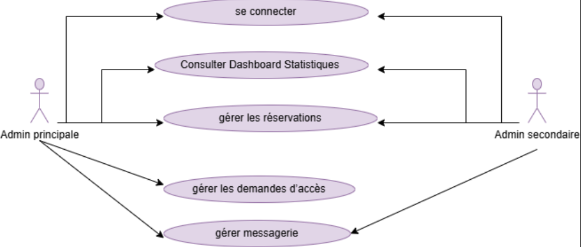
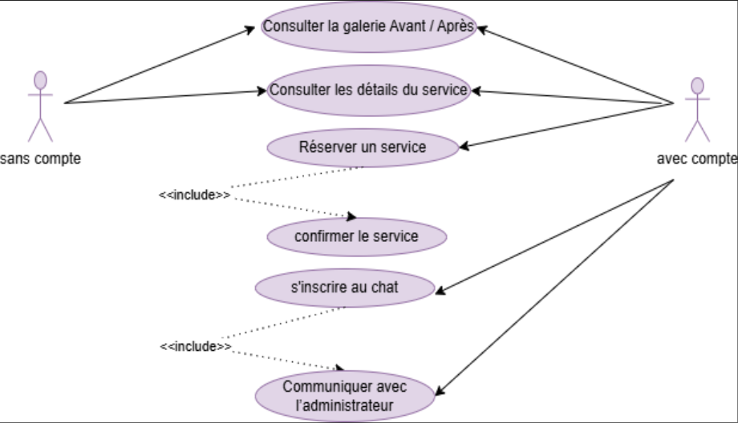
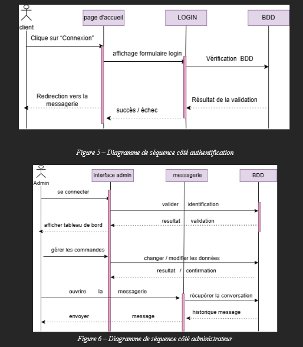
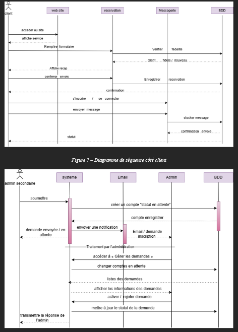

---

## 4. Illustrations Visuelles de l’Interface Utilisateur

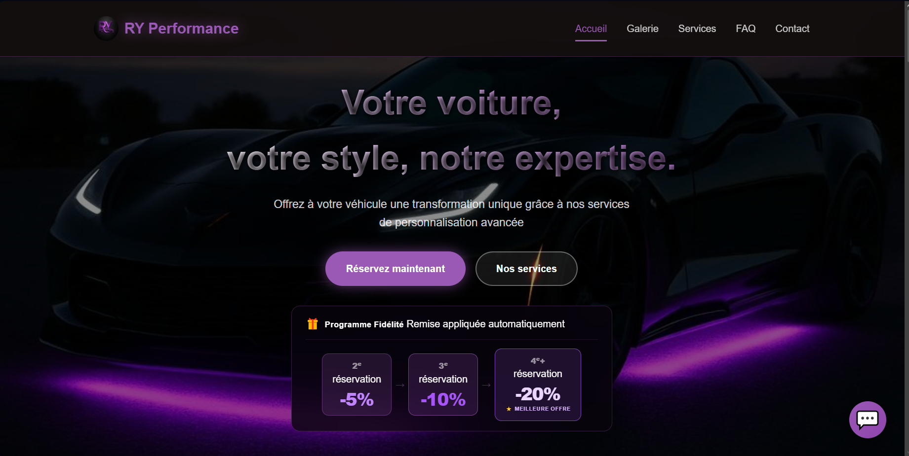
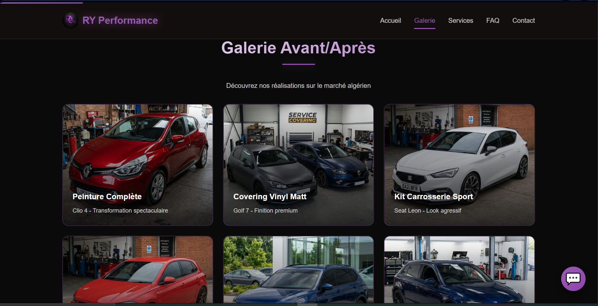
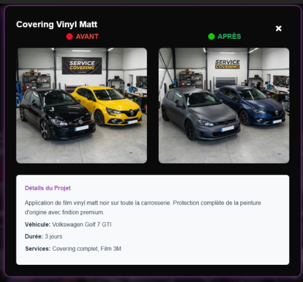
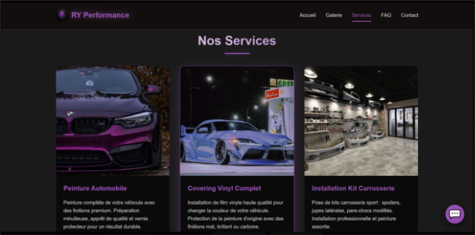
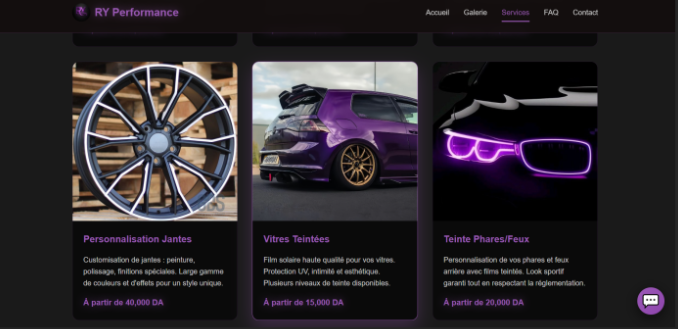
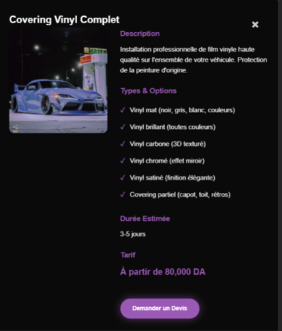
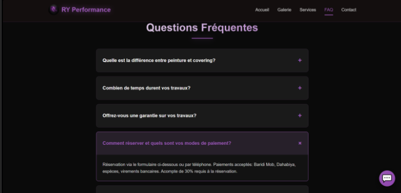
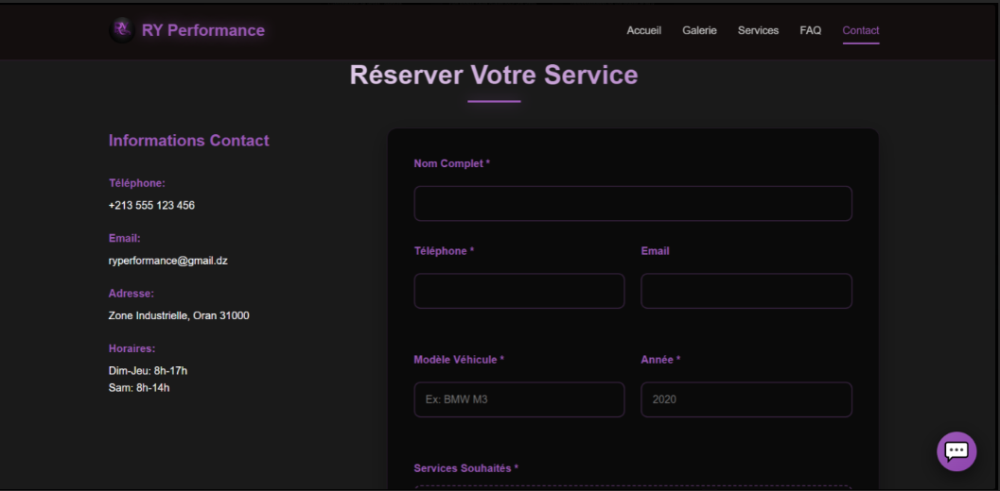
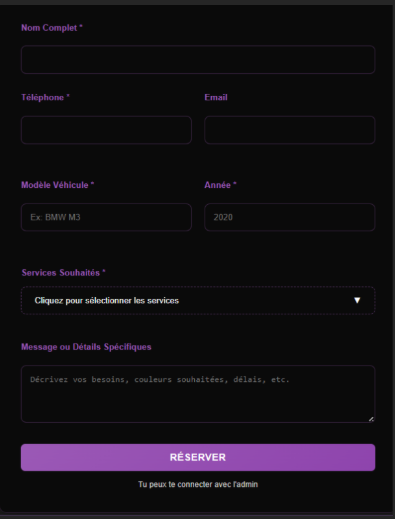
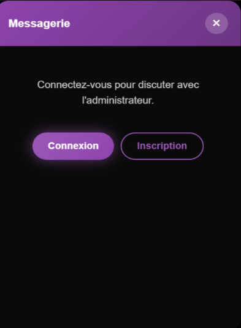
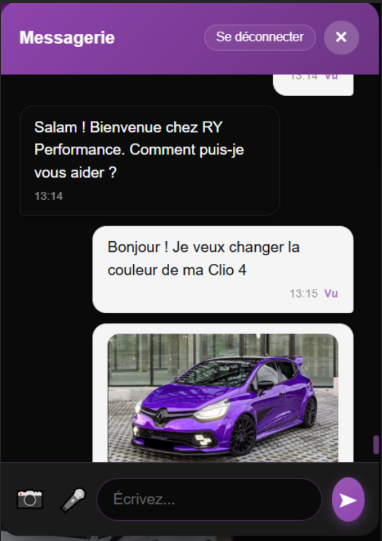

Les visuels ci-dessus présentent les principales interfaces destinées aux clients.

Ils illustrent :
- la page d’accueil,
- les services de personnalisation automobile,
- l’espace de réservation,
- le module de messagerie instantanée.

---

## 5. Illustrations Visuelles de l’Interface Administrateur Principal

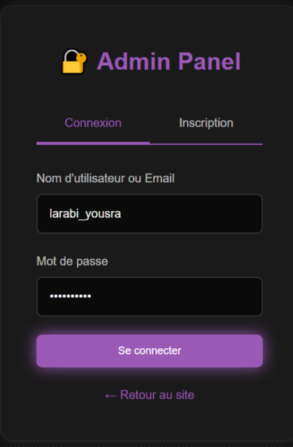
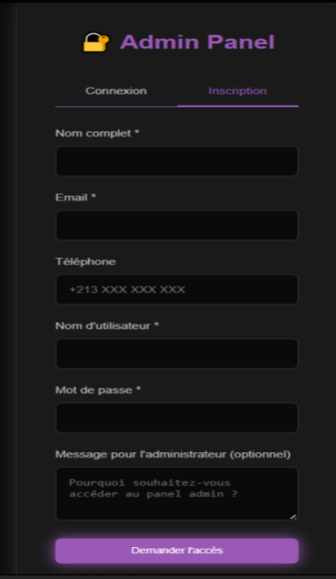
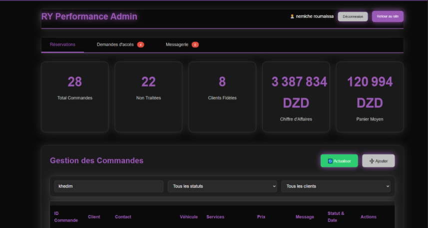
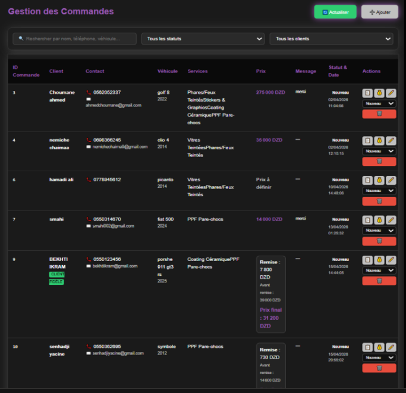
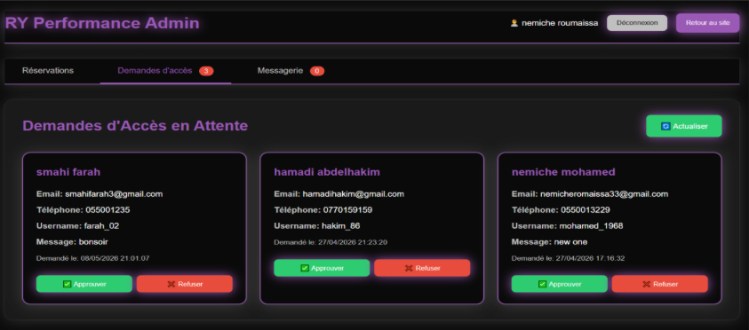
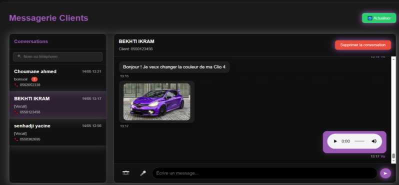
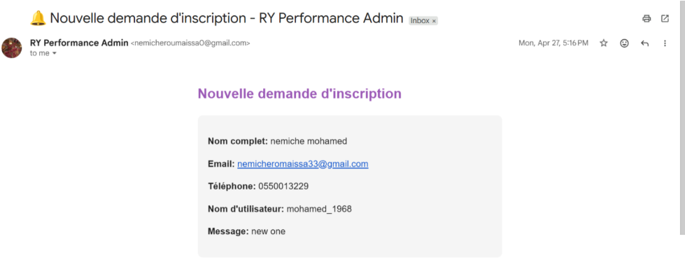
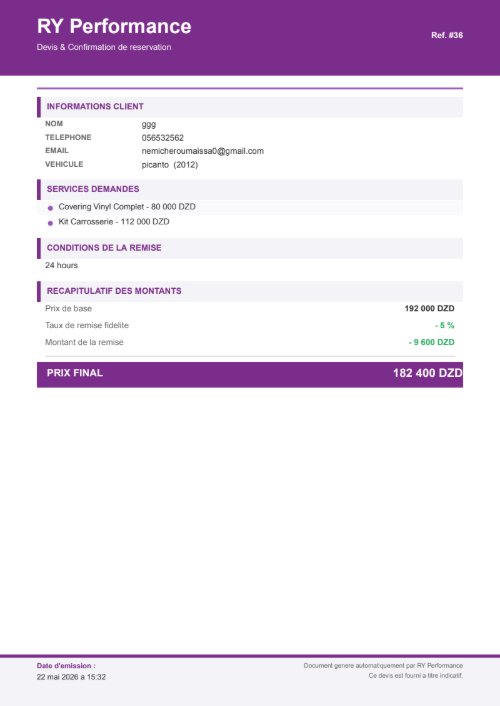

---

## 6. Illustrations Visuelles de l’Interface Administrateur Secondaire

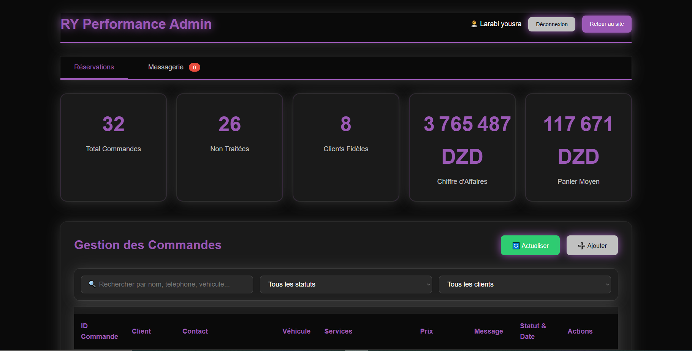

---

## Améliorations Futures

- Intégration d’un système de paiement en ligne
- Déploiement cloud de la plateforme
- Optimisation mobile avancée
- Système de recommandations intelligentes
- Tableau de bord analytique avancé
- Support multilingue

---

## Auteur

Projet développé par Roumaissa Nemiche  
Étudiante en informatique
